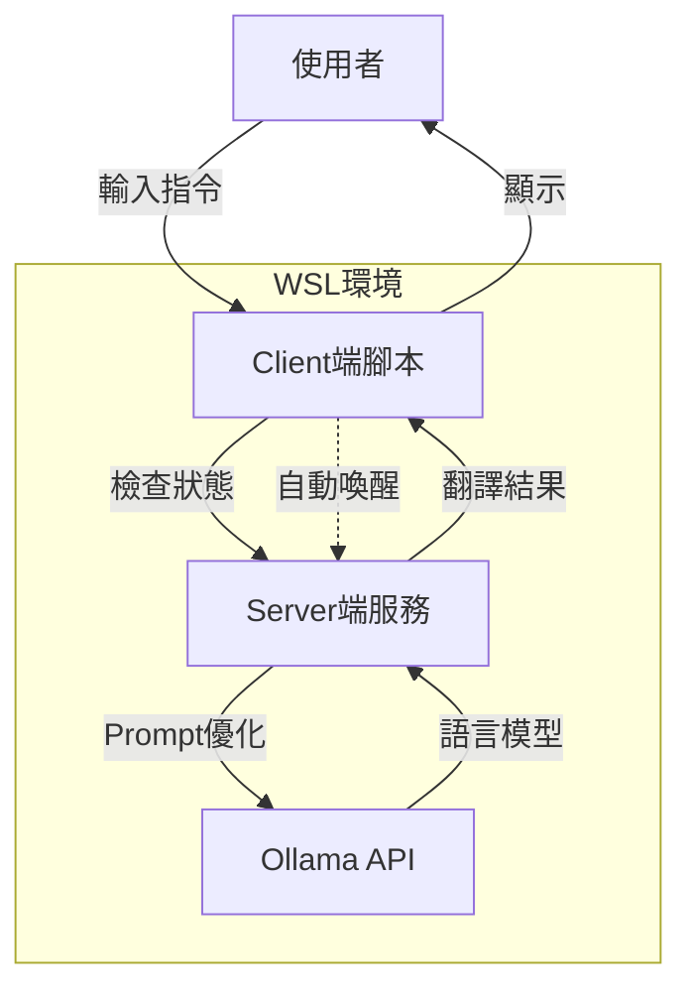

# TranslateGemma CLI Wrapper (翻譯小助手)

這是一個輕量級的 CLI 工具，專為在 Ollama 上運行的 Google `translategemma` 模型設計。它提供了一個簡單的指令列介面，讓您可以直接從終端機進行高品質的翻譯（支援 中 <-> 英 <-> 日），並具備自動語言偵測與背景服務管理功能。

## 架構說明 (Architecture)

本專案採用 Client-Server 架構，以維持與 Ollama API 的連線，並負責處理 Prompt 的組合與優化，使用者只需專注於輸入文字。



## 功能特色

- **智慧語言偵測 (Auto-Language Detection)**: 
    - 輸入 **中文** -> 自動翻成 **英文**
    - 輸入 **英文** -> 自動翻成 **繁體中文**
    - 輸入 **日文** -> 自動翻成 **繁體中文**
- **零配置服務 (Zero-Config Service)**: 當您輸入指令時，背景服務會自動啟動，無需手動管理伺服器。
- **跨平台支援**: 專為 WSL (Windows Subsystem for Linux) 設計，但可透過 PowerShell 從 Windows 端直接呼叫，達成無縫體驗。

## 安裝教學

### 前置需求
- **WSL 2** (Linux 環境)
- **Ollama** 已安裝並正在執行 (`ollama serve`)
- **translategemma** 模型已下載 (`ollama pull translategemma`)
- **Python 3**

### 設定步驟 (在 WSL 中)

1. 下載此專案代碼。
2. 執行安裝腳本：

```bash
bash setup.sh
```

3. 腳本執行完畢後，會顯示一行 `alias` 指令。請將該指令複製並貼上到您的 Shell 設定檔中（如 `.bashrc` 或 `.zshrc`），以便永久生效。

## 使用方法

### 1. 基本用法 (WSL 環境)

```bash
# 自動偵測：英文 -> 中文
trans "Hello World"

# 自動偵測：中文 -> 英文
trans "你好世界"

# 強制指定目標語言 (例如翻成日文)
trans -t ja "早安"
```

### 2. Windows 環境使用方法 (PowerShell)

若您希望不進入 WSL，直接在 Windows Terminal 使用此工具，請將以下函式加入您的 PowerShell 設定檔 (`notepad $PROFILE`)：

> **注意**: 請將變數 `$wslPath` 的路徑修改為您實際存放專案的路徑。

```powershell
function trans {
    # 設定 WSL 內的專案路徑
    $wslPath = "/home/art/projects/my-translate"
    $clientScript = "$wslPath/client.py"
    $venvPython = "$wslPath/.venv/bin/python3"

    # 將參數組合成字串
    $argsStr = $args -join " "
    
    # 透過 wsl 執行指令
    wsl $venvPython $clientScript "$argsStr"
}
```

設定完成後，您就可以在 PowerShell 中直接輸入：

```powershell
trans "Coding is fun"
```

### 3. 多行文字輸入

您可以使用引號將多行文字包起來進行翻譯：

```bash
trans "這是第一行
這是第二行
這是第三行"
```

## 授權 (License)

MIT