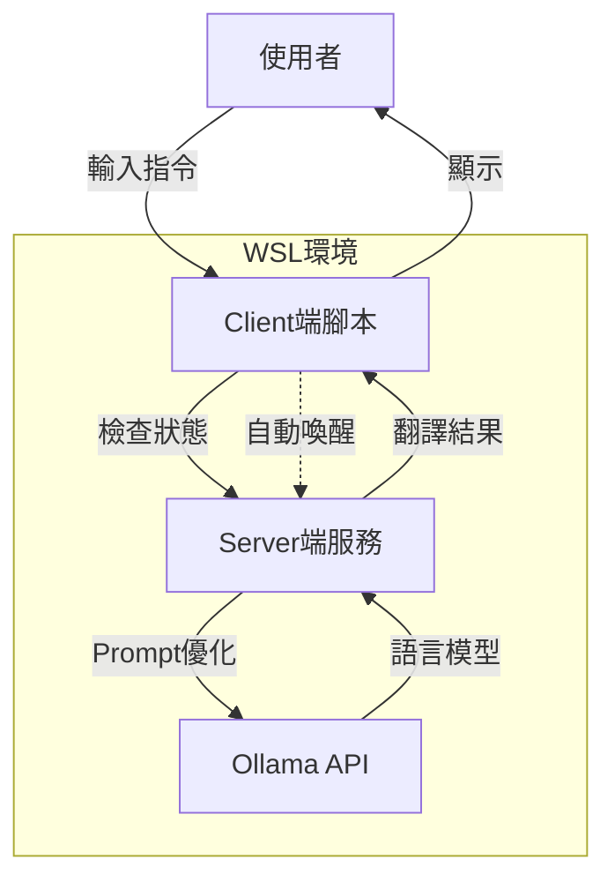

# TranslateGemma CLI Wrapper (翻譯小助手)

這是一個輕量級的 CLI 工具，專為在 [Ollama](https://ollama.com/) 上運行的 Google `translategemma` 模型設計。它具備自動語言偵測、背景服務管理與 Stdin (Pipe) 支援，讓您在終端機中獲得無縫的翻譯體驗。

## 架構說明 (Architecture)



## 功能特色

- **智慧語言偵測**: 自動處理 中->英、英->中、日->中 翻譯。
- **支援 Pipe 串接**: 支援 `echo "..." | trans` 或 Windows 下 `Get-Clipboard | trans`。
- **零配置服務**: 自動啟動與管理背景翻譯服務，反應迅速。
- **動態環境設定**: 透過 `setup.sh` 自動產生適合目前環境的路徑配置。

## 安裝教學

### 前置需求
- **WSL 2** (Linux 環境)
- **Ollama** 已安裝並執行，且已下載 `translategemma` 模型。
- **Python 3**

### 設定步驟

1. **在 WSL 中**執行安裝腳本：
   ```bash
   bash setup.sh
   ```

2. **WSL 使用者**: 
   依照腳本提示，將 `alias` 加入您的 `~/.bashrc` 或 `~/.zshrc`。

3. **Windows (PowerShell) 使用者**: 
   安裝腳本會自動產生 `windows_setup_snippet.txt`。請將該檔案內的內容複製並貼到您的 PowerShell 設定檔 (`notepad $PROFILE`) 中即可。

## 使用範例

```bash
# 基本使用
trans "Hello World"

# Pipe 使用 (Windows)
Get-Clipboard | trans
```

## 授權 (License)

MIT